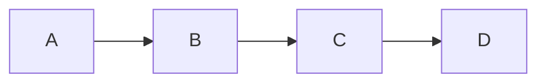

# Clickables

```mermaid
flowchart LR
    A-->B
    B-->C
    C-->D
    click A callback "Tooltip for a callback"
    click B "https://www.github.com" "This is a tooltip for a link"
    click C call callback() "Tooltip for a callback"
    click D href "https://www.github.com" "This is a tooltip for a link"
```
