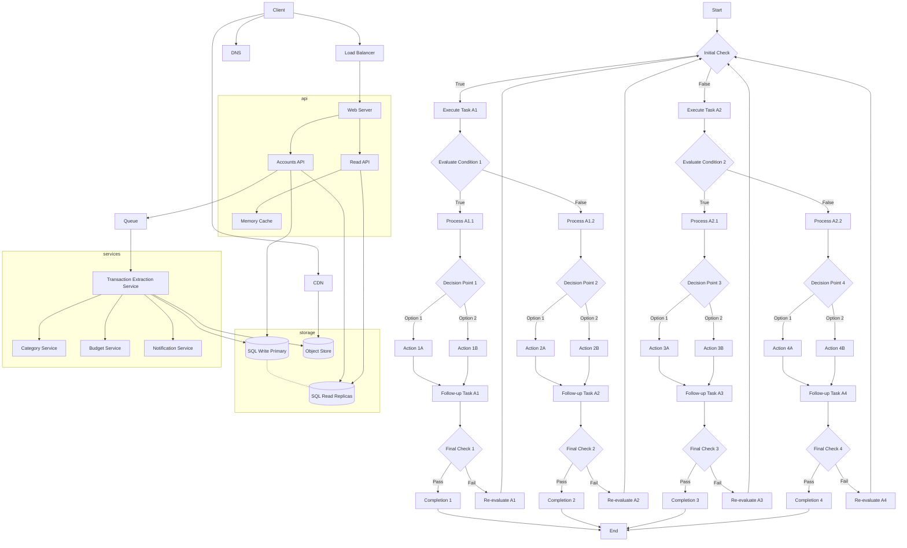
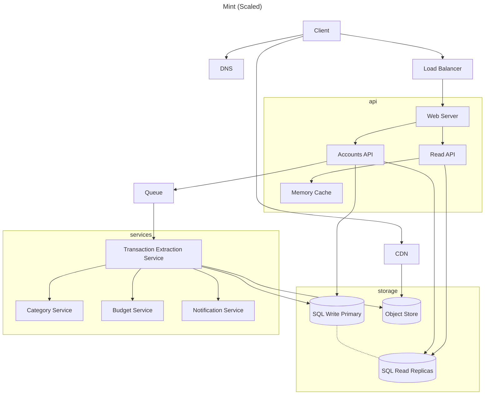

# Big Mermaid (excluded)

This page is excluded.

## Example 1

```mermaid
graph TD;
    A[Start] --> B{Initial Check};

    B --> |True| C[Execute Task A1];
    B --> |False| D[Execute Task A2];

    C --> E{Evaluate Condition 1};
    D --> F{Evaluate Condition 2};

    E --> |True| G[Process A1.1];
    E --> |False| H[Process A1.2];
    F --> |True| I[Process A2.1];
    F --> |False| J[Process A2.2];

    G --> K{Decision Point 1};
    H --> L{Decision Point 2};
    I --> M{Decision Point 3};
    J --> N{Decision Point 4};

    K --> |Option 1| O[Action 1A];
    K --> |Option 2| P[Action 1B];
    L --> |Option 1| Q[Action 2A];
    L --> |Option 2| R[Action 2B];
    M --> |Option 1| S[Action 3A];
    M --> |Option 2| T[Action 3B];
    N --> |Option 1| U[Action 4A];
    N --> |Option 2| V[Action 4B];

    O --> W[Follow-up Task A1];
    P --> W;
    Q --> X[Follow-up Task A2];
    R --> X;
    S --> Y[Follow-up Task A3];
    T --> Y;
    U --> Z[Follow-up Task A4];
    V --> Z;

    W --> AA{Final Check 1};
    X --> AB{Final Check 2};
    Y --> AC{Final Check 3};
    Z --> AD{Final Check 4};

    AA --> |Pass| AE[Completion 1];
    AA --> |Fail| AF[Re-evaluate A1];
    AB --> |Pass| AG[Completion 2];
    AB --> |Fail| AH[Re-evaluate A2];
    AC --> |Pass| AI[Completion 3];
    AC --> |Fail| AJ[Re-evaluate A3];
    AD --> |Pass| AK[Completion 4];
    AD --> |Fail| AL[Re-evaluate A4];

    AE --> AM[End];
    AF --> B;
    AG --> AM;
    AH --> B;
    AI --> AM;
    AJ --> B;
    AK --> AM;
    AL --> B;

    Client --> DNS & CDN & lb[Load Balancer]
    lb --> web[Web Server]
    subgraph api
    web --> accounts[Accounts API] & read[Read API]
    memoryCache[Memory Cache]
    end

    accounts --> queue[Queue] --> tes


    subgraph storage
    dbPrimary[(SQL Write Primary)] -.- dbReplica[(SQL Read Replicas)]
    objectStore[(Object Store)]
    end

    subgraph services
    tes[Transaction Extraction Service] --> category[Category Service] & budget[Budget Service] & notif[Notification Service]
    end

    tes --> objectStore
    CDN --> objectStore
    tes --> dbPrimary
    accounts --> dbPrimary & dbReplica
    read --> dbReplica & memoryCache[Memory Cache]
```

## Example 2

This is the second ecample.

```mermaid
---
title: Mint (Scaled)
---
graph TB
Client --> DNS & CDN & lb[Load Balancer]
lb --> web[Web Server]
subgraph api
web --> accounts[Accounts API] & read[Read API]
memoryCache[Memory Cache]
end

accounts --> queue[Queue] --> tes


subgraph storage
dbPrimary[(SQL Write Primary)] -.- dbReplica[(SQL Read Replicas)]
objectStore[(Object Store)]
end

subgraph services
tes[Transaction Extraction Service] --> category[Category Service] & budget[Budget Service] & notif[Notification Service]
end

tes --> objectStore
CDN --> objectStore
tes --> dbPrimary
accounts --> dbPrimary & dbReplica
read --> dbReplica & memoryCache[Memory Cache]
```
