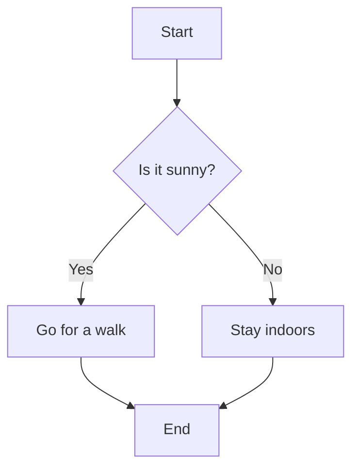

# Usage

## Mouse

Press ++alt++ and grab the diagram with your mouse to move it. The same applies to the zooming press ++alt++ and scroll.

## Keyboard

You can also control it with your keyboard.

Use the arrow keys to move it around and the ++plus++ and ++minus++ key to zoom in and out.
