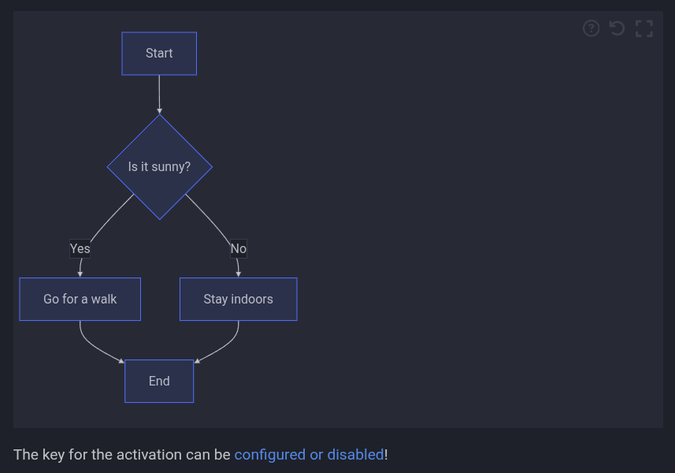
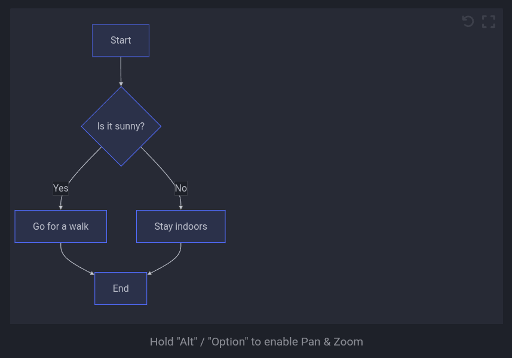
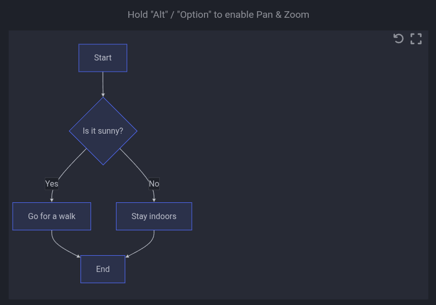
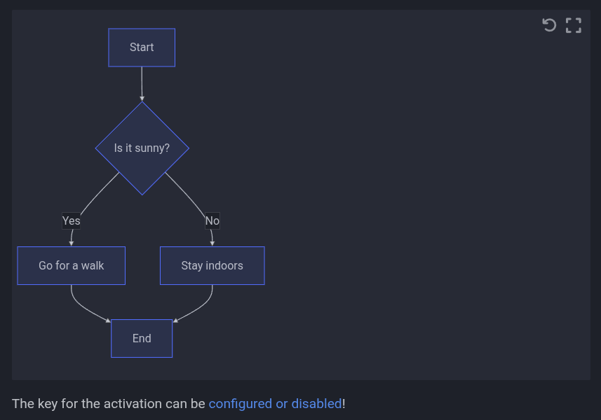

# Home

This plugin makes use of the [panzoom](https://github.com/anvaka/panzoom) library by [Andrei Kashcha](https://github.com/anvaka)

## Setup

`pip install mkdocs-panzoom-plugin`

Add it to your `mkdocs.yaml`:

```yaml
plugins:
  - search
  - panzoom

```

!!! warning

    As of version 0.4.0 (performance optimizations) the following lines are needed:

    ```yaml
    markdown_extensions:
      - pymdownx.superfences:
          custom_fences:
            - name: mermaid
              class: mermaid
              format: !!python/name:pymdownx.superfences.fence_code_format
    ```

    Make sure to define the `site_url` otherwise it won't work!

    **Example**:

    ```yaml
    site_url: https://playg0n.github.io/mkdocs-panzoom/
    ```

## Usage

Examples and usage are available in the [docs](https://playg0n.github.io/mkdocs-panzoom/Usage/).

## Config

### Selectors

Mermaid and D2 are included by default, but you can add any arbitrary selector or exclude the default ones.
To enable images add the `img` tag like below.

```yaml
plugins:
  - panzoom:
      include_selectors:
        - .myClass # class in html
        - "#myId" # id in html
        - "img" # tag in html
      exclude_selectors:
        - ".mermaid"
        - ".d2"
```

### Hint

### Toggle

=== "Toggleable (Default)"

    This makes the hint on how to use it toggleable

    {.pz-ignore}

    ```yaml
    plugins:
      - panzoom:
          always_show_hint: false # default false
    ```

=== "Always"

    This makes the hint on how to use it permanently visible


    {.pz-ignore}

    ```yaml
    plugins:
      - panzoom:
          always_show_hint: true # default false
    ```

### Location

This changes the location of the hint

=== "Bottom (Default)"

    Display hint at the bottom

    {.pz-ignore}

    ```yaml
    plugins:
      - panzoom:
          hint_location: "bottom" # default bottom
    ```

=== "Top"

    Display hint at the top

    {.pz-ignore}

    ```yaml
    plugins:
      - panzoom:
          hint_location: "top" # default bottom
    ```

=== "Disabled"

    Hide hint completely

    {.pz-ignore}

    ```yaml
    plugins:
      - panzoom:
          hint_location: "disabled" # default bottom
    ```

### Use different key

Options for activation key are:

- alt
- ctrl
- shift
- none

```yaml
plugins:
  - panzoom:
      key: "ctrl" # default alt
```

### Set Initial Zoom Level

This sets the initial zoom level for all diagrams and images.

```yaml
plugins:
  - panzoom:
      initial_zoom_level: 1.5 # default 1.0
```

### Exclude Pages

```yaml
plugins:
  - panzoom:
      exclude:
        - Path/to/page.md
```

### Enable Fullscreen

```yaml
plugins:
  - panzoom:
      full_screen: True # default False
```

## Automatic Zoom State Persistence

The plugin automatically saves the zoom level and pan position for each diagram to your browser's localStorage. This means:

- **Persistent Settings**: Your preferred zoom level and position for each diagram are remembered across page reloads
- **Per-Diagram Memory**: Each diagram on a page maintains its own zoom state independently
- **Automatic Cleanup**: Saved states older than 30 days are automatically cleared
- **Reset Functionality**: Using the reset button clears the saved state for that diagram and returns to the configured initial zoom level

This feature works automatically - no additional configuration is required. The zoom states are stored locally in your browser and are not shared between different browsers or devices.

## Credits

The structure and some parts are from the [enumerate-headings-plugin](https://github.com/timvink/mkdocs-enumerate-headings-plugin)
